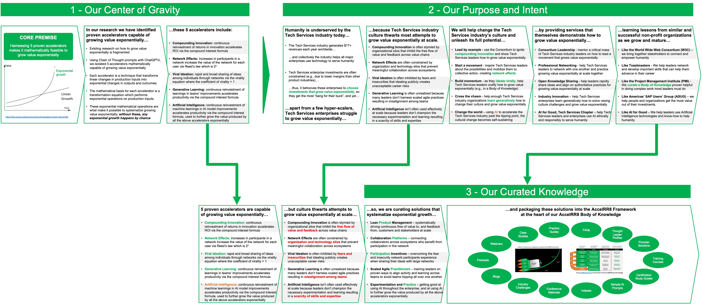

# Network Structure

The **AccelRR8 Consortium Network** interacts with people and organizations who are 

- **participants** with stronger bonds to our Consortium network:
	- **State of Maryland** where the Consortium is incorporated
	- Consortium **Board of Directors** who oversees Consortium Management
	- Consortium **Management** who operate the Consortium Management System
	- Consortium **Leaders** who provide Consortium services and grow Consortium value
	- Consortium **Subscribers** who engage with Consortium services
	- Consortium **Patrons** who donate to the Consortium  

- **other stakeholders** with weaker bonds to our Consortium network:
	- **Influencers** who raise awareness of the Consortium with potential participants

# Cumulative Logic

The Consortium's cumulative logic provides the rationale for its core premise, center of gravity, purpose and intent, products and services, and curated knowledge.  It provides guardrails for Consortium decision-making and helps Consortium leadership avoid the temptation to try to "boil the ocean".  To quote Einstein, it strives to be "as simple as it can be, but no simpler."

# Organizational Plan

The Consortium's organizational plan is the foundation of the Consortium.  It is based on [business plan guidance provided by the US Small Business Administration](https://www.sba.gov/counseling/plan-your-business/#business-plan).

