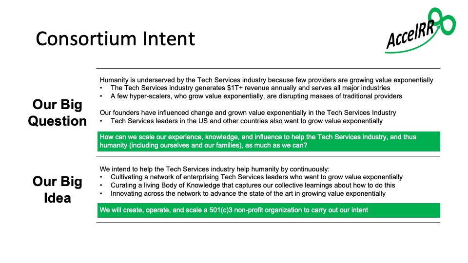
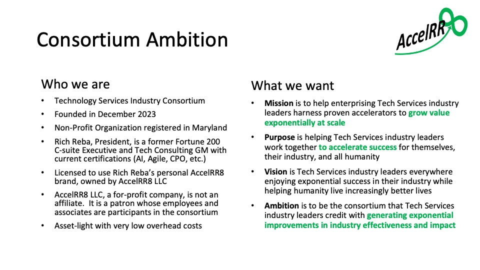
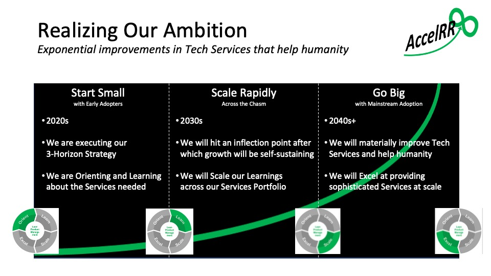
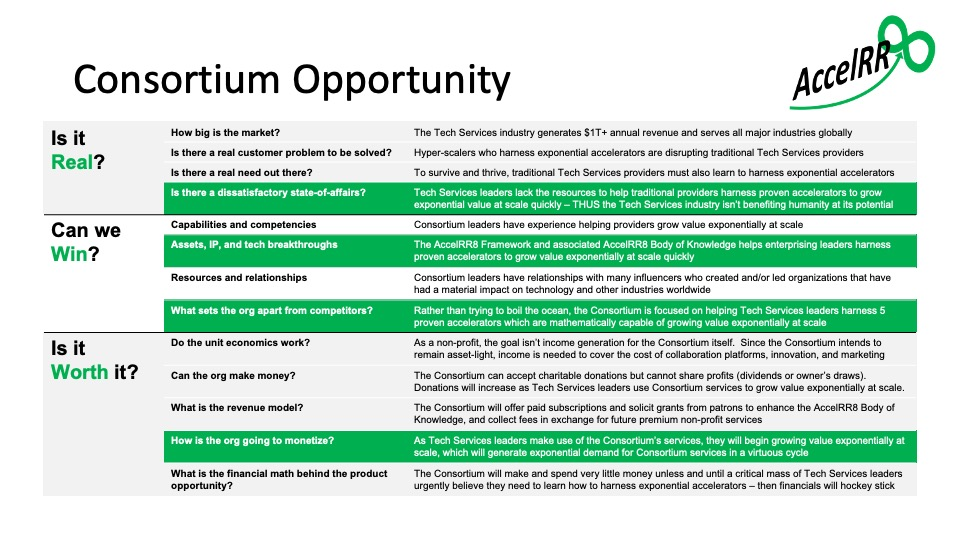
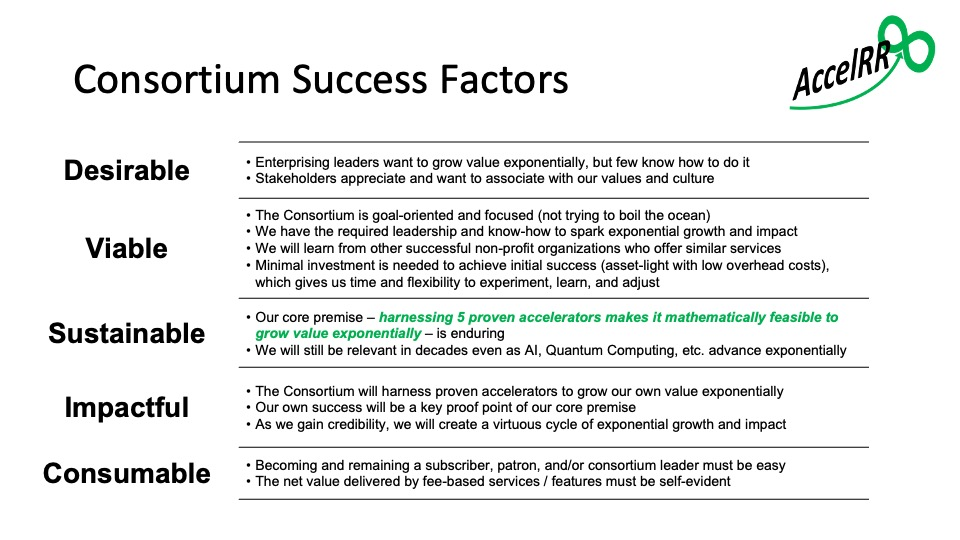
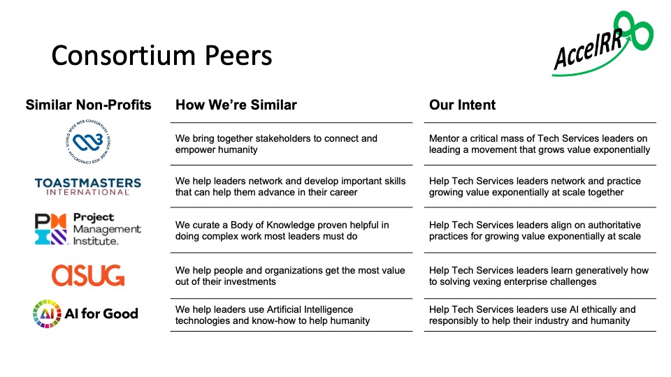
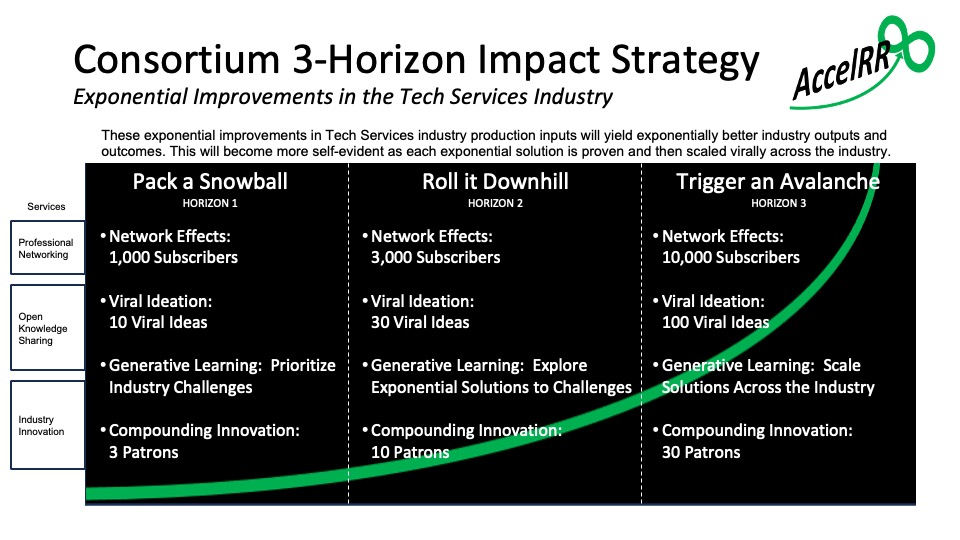
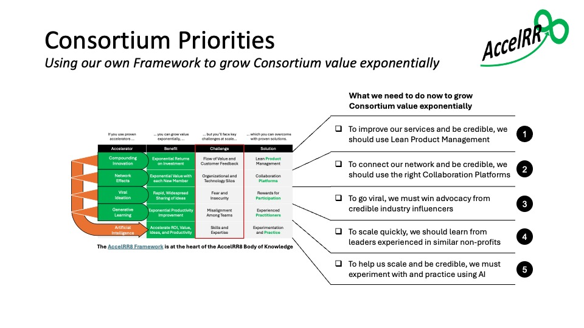
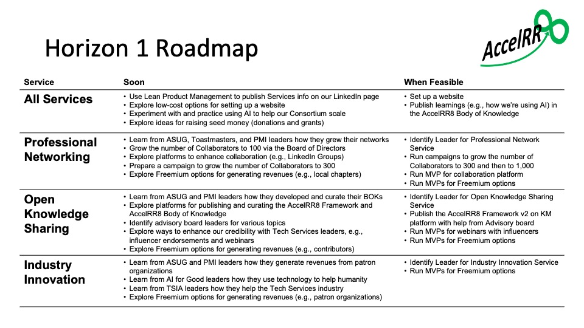

# Consortium Vision and Strategy

## Consortium Intent and Ambition

Our founders formulated our Consortium Intent which undergirds our Ambition and everything we do.

Fully realizing our ambition will require perseverance and tenacity over decades.

## Consortium Opportunity

We believe the opportunity is real, achievable, and worth it!

We must stay focused on our core premise / center of gravity or we'll end up trying to "boil the ocean".

## Success Factors

It's ambitious but we can do this!

We must learn from other successful non-profit organizations who offer similar services.

## 3-Horizon Roadmap for the 2020s 

