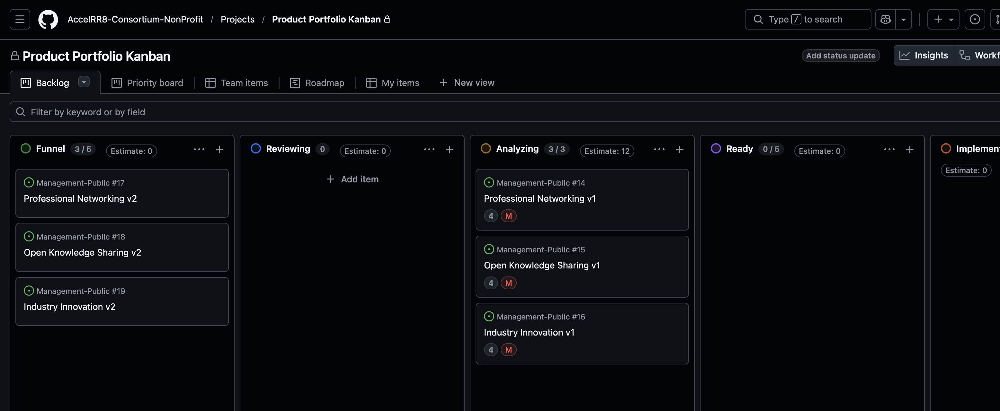
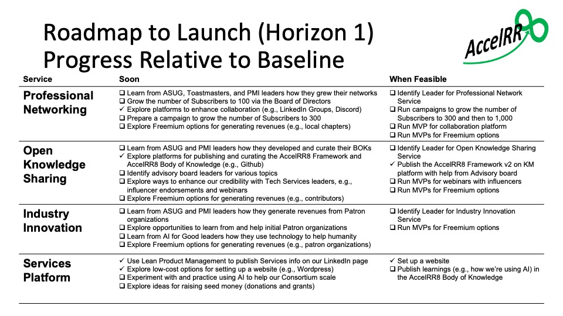

# Product Portfolio Kanban

[Link to Live Product Portfolio Kanban in Github](https://github.com/orgs/AccelRR8-Consortium-NonProfit/projects/3/views/1)

# Product Roadmap Status

We have made progress on our top two Product priorities:  using LPM, and identifying the right Collaboration Platforms to connect our network and be credible.

To win advocacy from credible industry influencers and go viral, we must hone our messages and launch a campaign.

To scale quickly, we must learn from leaders experienced in similar non-profits, especially ASUG and the Bender Leadership Academy.

To help us scale and be credible, we must experiment with and practice using AI for all of these activities.