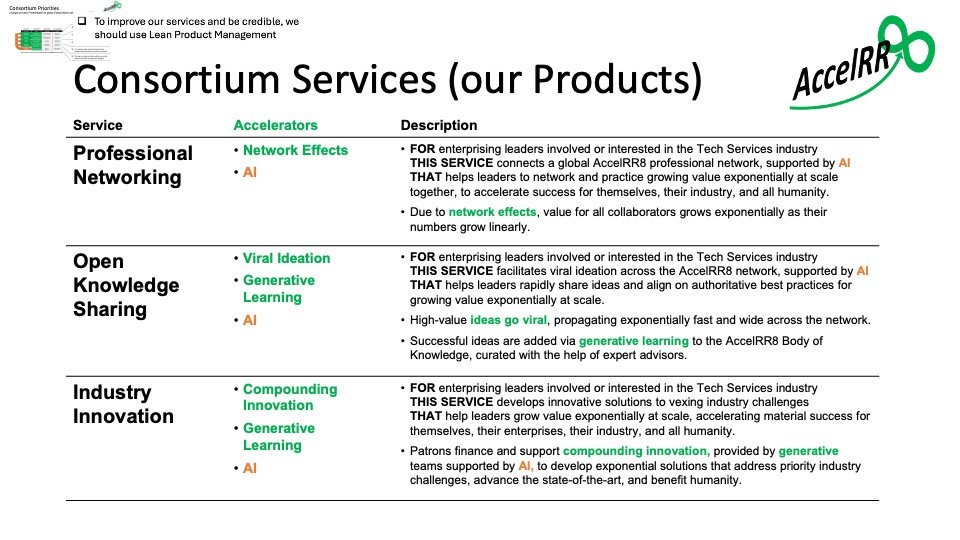
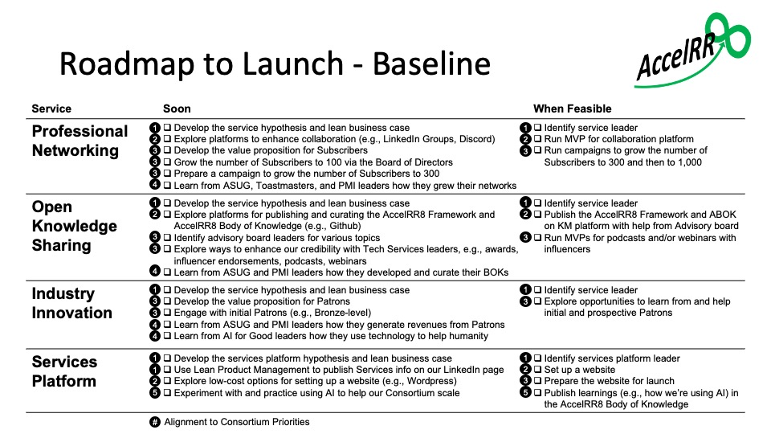
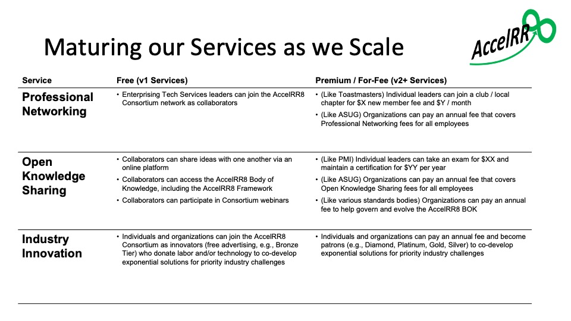

# Product Management Plan

## Using Lean Product Management

One of our [Consortium’s strategic priorities](https://accelrr8-consortium-nonprofit.github.io/Management-Public/?page=1_Integration/1b_Strategy/1b_Consortium_Vision_and_Strategy#executing-our-3-horizon-strategy) is “to improve our services and be credible, we should use Lean Product Management”.

From the beginning, we have been using Lean Product Management (LPM) to develop Consortium Services and ignite compounding innovation.

- First we developed the [Epic Hypothesis Statement](https://github.com/AccelRR8-Consortium-NonProfit/Management-Public/blob/main/docs/2_Value_Creation/2a_Product/AccelRR8_Consortium_NonProfit_Services_Portfolio_Epic-Hypothesis-Statement.pdf) and the [Lean Business Case](https://github.com/AccelRR8-Consortium-NonProfit/Management-Public/blob/main/docs/2_Value_Creation/2a_Product/AccelRR8_Consortium_NonProfit_Services_Portfolio_Lean_Business_Case.pdf) for the Services Portfolio overall.

- Next we developed a plan for version 1 of each service.  

The scope of our services, shown in the graphic below, was defined in the Epic Hypothesis Statement and Lean Business Case for v1 of each service. You can view these and other service deliverables in the [Product Management Repository](./2a_Product_Management_Repository) under the Deliverables header.

Additional deliverables were / will be developed for each service version as it moves through its lifecycle.   

## Product Plan

Our plan builds on the ["Grow Value Exponentially"](https://accelrr8.github.io/AccelRR8-Framework/?page=Grow_Value_Exponentially&location=) story in the AccelRR8 Framework.

In the below graphic we show how we will use the AccelRR8 Framework to launch and grow the AccelRR8 Consortium’s value exponentially as it climbs and begins delivering benefits at scale.  

Specific actions we will take, and leading indicators we will measure, are shown in both Launch and Climb / Scale stages.

These actions are organized into our 3 services:  Professional Networking, Open Knowledge Sharing, and Industry Innovation

# Product Roadmap

The below graphic shows specific actions we are taking for our Services during the Launch Phase of our Product Plan.  These actions are aligned to our Consortium Priorities. 

The below graphic shows potential features and pricing models for our Services when we enter the Climb / Scale Stage of our Product Plan.

