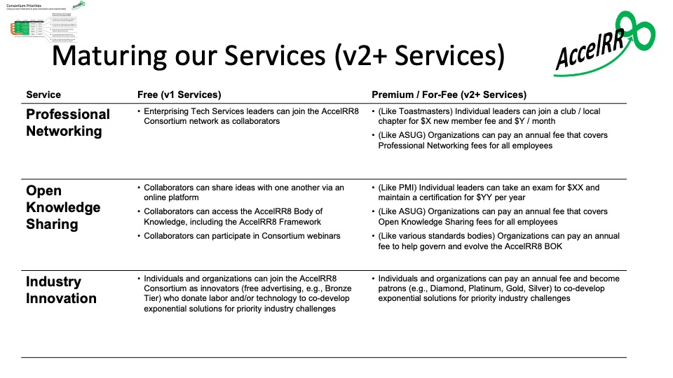

# Product Management Plan

Our plan builds on the ["Grow Value Exponentially"](https://accelrr8.github.io/AccelRR8-Framework/?page=Grow_Value_Exponentially&location=) story in the AccelRR8 Framework.

# Product Plan

In the below graphic we show how we will use the AccelRR8 Framework to launch and grow the AccelRR8 Consortium’s value exponentially as it climbs toward achieving exponential benefits at scale.

This is how we will achieve one of our key Success Factors:  “Our own success will be a key proof point of our core premise”

Specific actions we will take, and leading indicators we will measure, are shown in both Launch and Climb / Scale stages.

These actions are organized into 3 services:  Professional Networking, Open Knowledge Sharing, and Industry Innovation

# Using Lean Product Management

One of our Consortium’s strategic priorities is “to improve our services and be credible, we should use Lean Product Management”.

From the beginning, we have been using Lean Portfolio Management (LPM) to develop Consortium Services and ignite compounding innovation.

First we developed the [Epic Hypothesis Statement](https://github.com/AccelRR8-Consortium-NonProfit/Management-Public/blob/main/docs/2_Value_Creation/2a_Product/AccelRR8_Consortium_NonProfit_Services_Portfolio_Epic-Hypothesis-Statement.pdf) and the [Lean Business Case](https://github.com/AccelRR8-Consortium-NonProfit/Management-Public/blob/main/docs/2_Value_Creation/2a_Product/AccelRR8_Consortium_NonProfit_Services_Portfolio_Lean_Business_Case.pdf) for the Services Portfolio overall.

We then decomposed the Services Portfolio into separate Epics for version 1 of each service.  The scope of our services as shown in the graphic below was defined in the Epic Hypothesis Statement and Lean Business Case for v1 of each Service, which you can view in the [Product Management Repository](./2a_Product_Management_Repository) under the Deliverables header.

Additional deliverables are then developed for each service version as it moves through its lifecycle.   

# Product Roadmap

The below graphic shows specific actions we are taking for our Services during the Launch Stage, aligned with the Product Priorities above. 

The below graphic shows potential features and pricing models for our Services when we enter the Climb Stage and our services begin to achieve scale.

