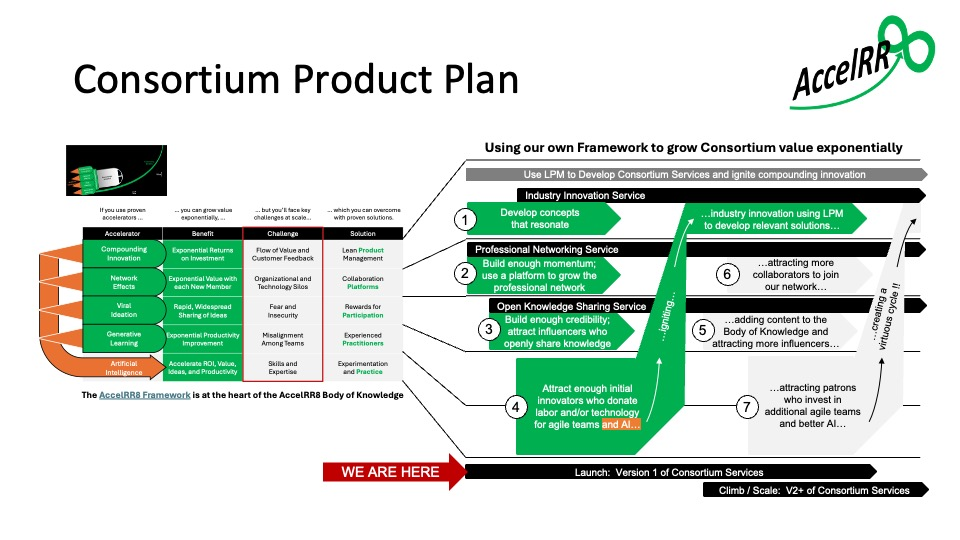
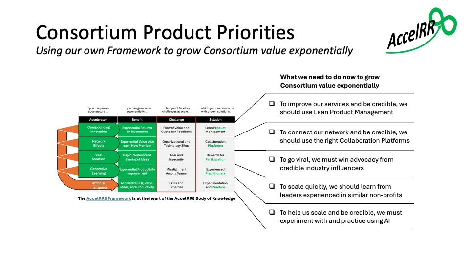
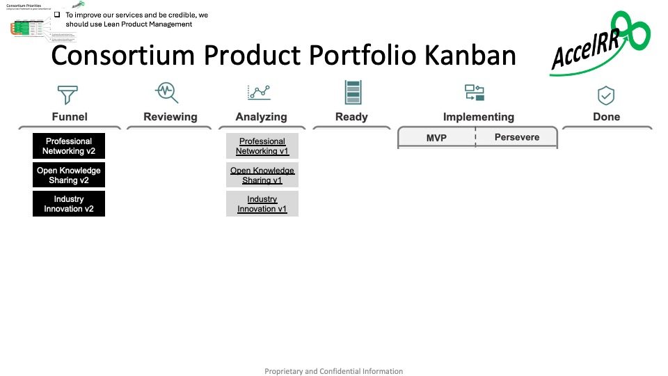
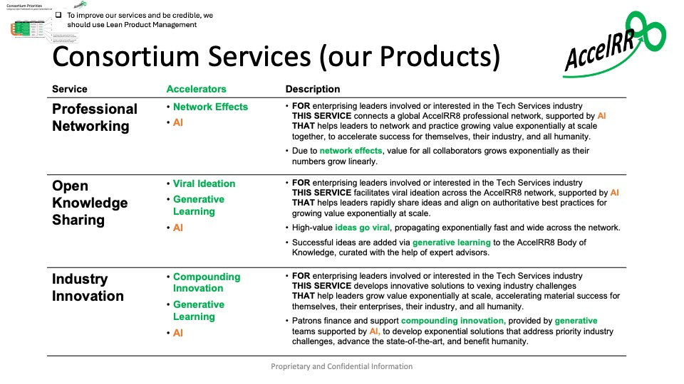
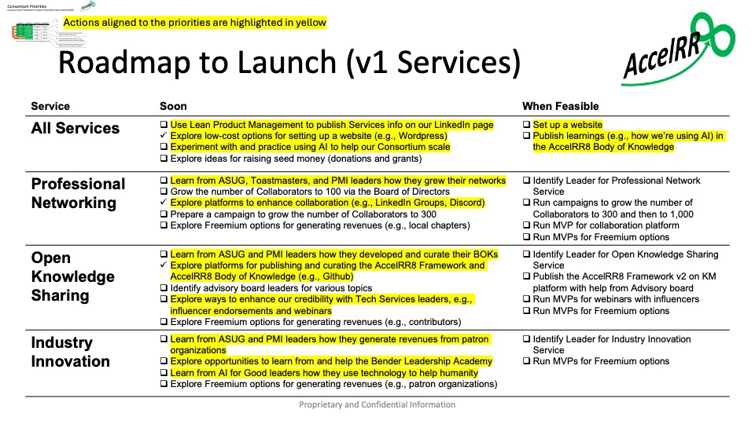
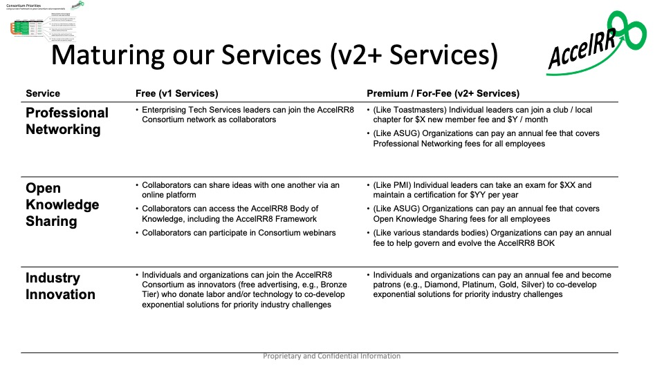

# Product Management Plan

Our plan builds on the ["Grow Value Exponentially"](https://accelrr8.github.io/AccelRR8-Framework/?page=Grow_Value_Exponentially&location=) story in the AccelRR8 Framework.

# Product Plan

In the below graphic we show how we will use the AccelRR8 Framework to launch and grow the AccelRR8 Consortium’s value exponentially as it climbs toward achieving exponential benefits at scale.

This is how we will achieve one of our key Success Factors:  “Our own success will be a key proof point of our core premise”

Specific actions we will take, and leading indicators we will measure, are shown in both Launch and Climb / Scale stages.

These actions are organized into 3 services:  Professional Networking, Open Knowledge Sharing, and Industry Innovation

# Product Priorities

The below graphic shows our most important near term product priorities.

## Use Lean Product Management

Our Consortium’s first Product Priority is “To improve our services and be credible, we should use Lean Product Management”

From the beginning, we have been using Lean Portfolio Management (LPM) to develop Consortium Services and ignite compounding innovation.

The below graphic is a view of the SAFe v6 Portfolio Kanban for our Services Portfolio.  SAFe is an acronym that stands for Scaled Agile Framework.

We are using Lean Product Management to define the scope of our services.

# Product Roadmap

The below graphic shows specific actions we are taking for our Services during the Launch Stage.  Actions aligned to our Product Priorities are highlighted in yellow.

We have made progress on our top two Product priorities:  using LPM, and identifying the right Collaboration Platforms to connect our network and be credible.

To win advocacy from credible industry influencers and go viral, we must hone our messages and launch a campaign.

To scale quickly, we must learn from leaders experienced in similar non-profits, especially ASUG and the Bender Leadership Academy.

To help us scale and be credible, we must experiment with and practice using AI for all of these activities.

The below graphic shows potential features and pricing models for our Services when we enter the Climb Stage and our services begin to achieve scale.

