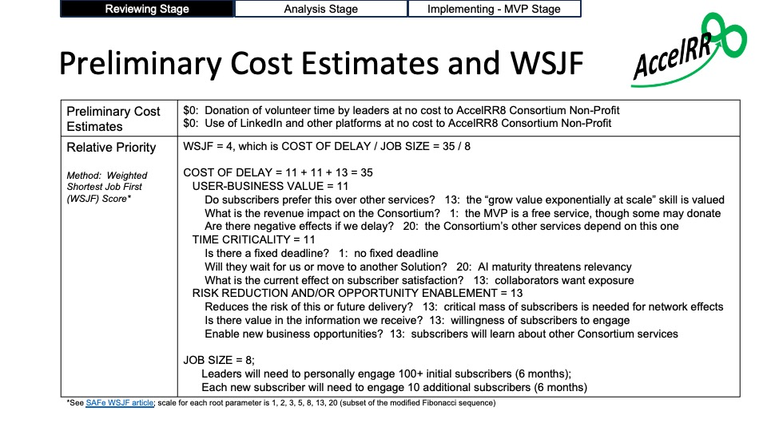
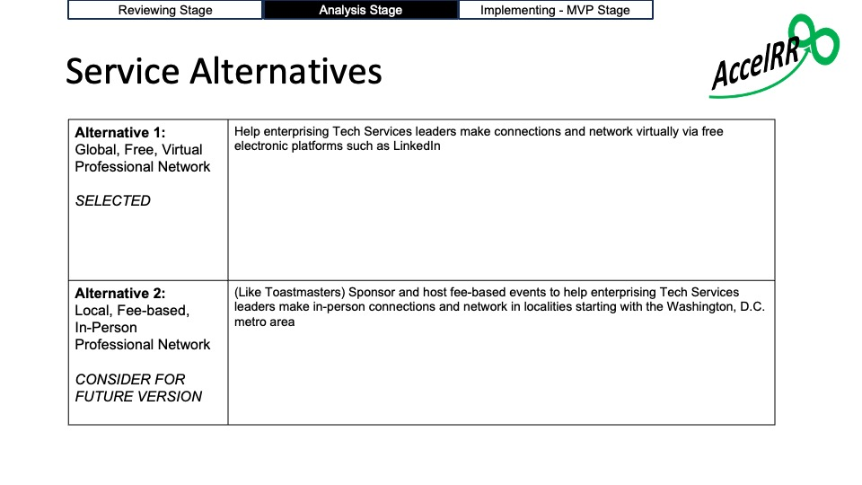
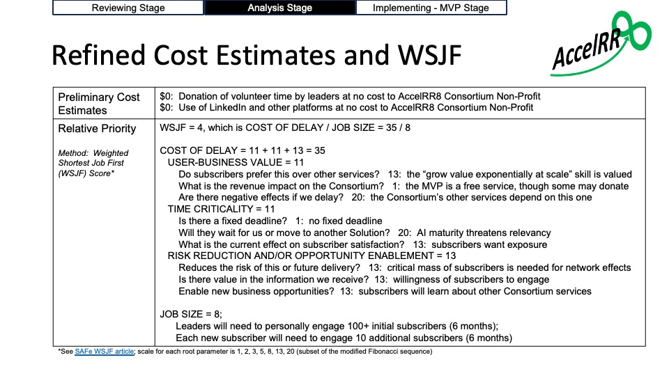

# Deliverables for Consortium Services

---
## Professional Networking v1

- [Professional Networking v1](https://github.com/AccelRR8-Consortium-NonProfit/Management-Public/blob/main/docs/2_Value_Creation/2a_Product/Professional_Networking/Professional_Networking_v1_Deliverables_Overview.pdf)

### Reviewing Stage

#### Epic Hypothesis

- [Epic Hypothesis Statement](https://github.com/AccelRR8-Consortium-NonProfit/Management-Public/blob/main/docs/2_Value_Creation/2a_Product/Professional_Networking/Professional_Networking_v1_Epic-Hypothesis-Statement.pdf)

### Preliminary Cost Estimates and Priority

### Analysis Stage

#### Service Alternatives

#### Refined Cost Estimates and Priority

#### Lean Business Case

- [Lean Business Case](https://github.com/AccelRR8-Consortium-NonProfit/Management-Public/blob/main/docs/2_Value_Creation/2a_Product/Professional_Networking/Professional_Networking_v1_Lean_Business_Case.pdf)

### Implementing - MVP Stage

- Service Strategy
- Service Context
- Service Intent
- Development Kit
- Demand Generation Kit
- Beneficiaries Engagement Kit
- Delivery Kit

---

## Open Knowledge Sharing v1

- Open Knowledge Sharing v1

---

## Industry Innovation v1

- [Industry Innovation v1](https://github.com/AccelRR8-Consortium-NonProfit/Management-Public/blob/main/docs/2_Value_Creation/2a_Product/Industry_Innovation/Industry_Innovation_v1_Deliverables_Overview.pdf)

# Full Product Management Repository

[Product Management Repository on Github](https://github.com/AccelRR8-Consortium-NonProfit/Management-Public/tree/main/docs/2_Value_Creation/2a_Product)