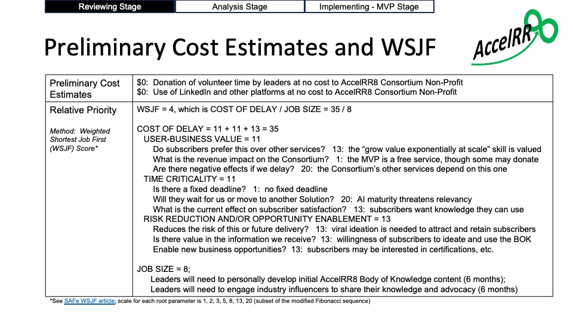
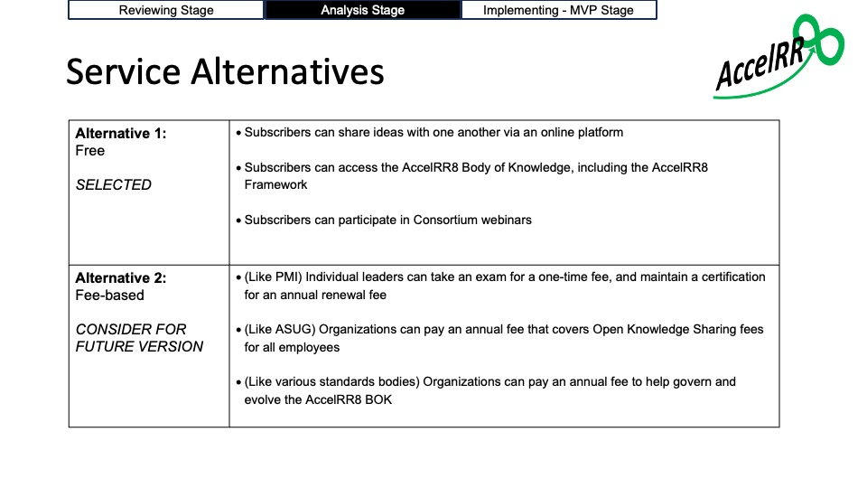
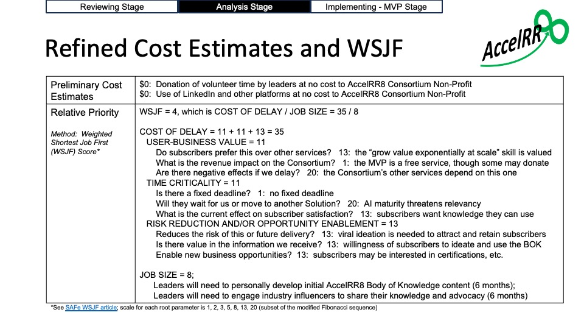

# Open Knowledge Sharing v1 Deliverables

---

## Reviewing Stage

### Epic Hypothesis

- [Epic Hypothesis Statement](https://github.com/AccelRR8-Consortium-NonProfit/Management-Public/blob/main/docs/2_Value_Creation/2a_Product/Open_Knowledge_Sharing/v1/Open_Knowledge_Sharing_v1_Epic-Hypothesis-Statement.pdf)

### Preliminary Cost Estimates and Priority

---

## Analysis Stage

### Service Alternatives

### Refined Cost Estimates and Priority

### Lean Business Case

- [Lean Business Case](https://github.com/AccelRR8-Consortium-NonProfit/Management-Public/blob/main/docs/2_Value_Creation/2a_Product/Open_Knowledge_Sharing/v1/Open_Knowledge_Sharing_v1_Lean_Business_Case.pdf)

---

## Implementing - MVP Stage

- Service Strategy
- Service Context
- Service Intent
- Development Kit
- Demand Generation Kit
- Beneficiaries Engagement Kit
- Delivery Kit
